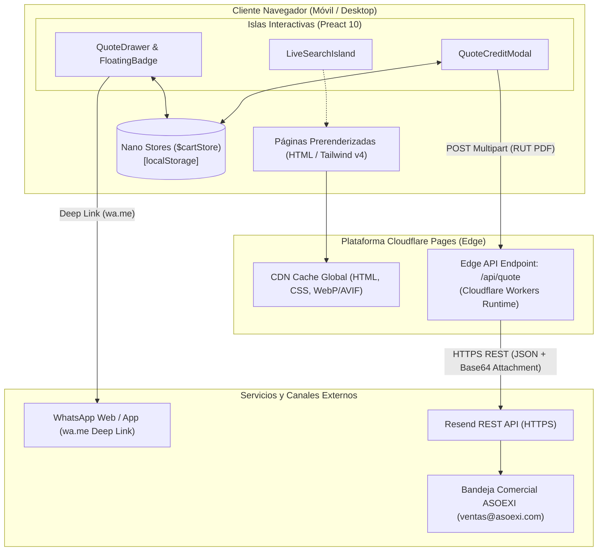
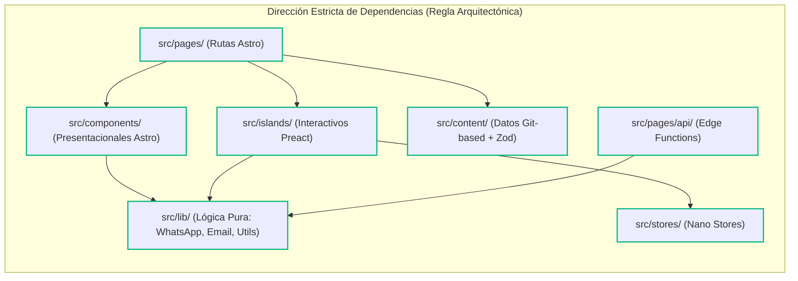

# Architecture Spine — asoexi-app

## Design Paradigm

El sistema adopta el paradigma de **Arquitectura de Islas (Islands Architecture)** implementado sobre Astro. La superficie completa del sitio (catálogo de marcas, categorías, fichas de productos y silos de aterrizaje SEO) se genera como HTML estático puro (SSG) en tiempo de compilación con cero JavaScript enviado al cliente por defecto.

Las funcionalidades interactivas (buscador en tiempo real, cajón de cotización y modal de solicitud de crédito) se ejecutan como **islas cliente aisladas** desarrolladas en Preact, coordinadas a través de un bus de estado reactivo y ligero en memoria del navegador (`nanostores`), sin incurrir en costos de hidratación masiva.



## Invariants & Rules

### AD-1 — Arquitectura de Islas con Prerenderizado Estático Obligatorio
- **Binds:** `FR-1`, `FR-2`, `FR-3`, `FR-4`, `FR-5`, `FR-6`, `FR-11`, `NFR-1`, `NFR-2`
- **Prevents:** Hidratación monolítica de React en cliente, tiempos lentos de Largest Contentful Paint (LCP) y sobrecostos de procesamiento en servidor.
- **Rule:** Todo layout y página de contenido (`src/pages/**/*.astro`) debe compilarse como SSG prerenderizado estático (`prerender = true`), enviando 0 KB de JavaScript para renderizado de texto/marcado. Los componentes interactivos deben residir exclusivamente en `src/islands/` como componentes Preact montados con directivas de cliente explícitas (`client:idle` o `client:visible`).

### AD-2 — Catálogo de Productos y Marcas en Colecciones Git-based con Esquema Zod
- **Binds:** `FR-1`, `FR-2`, `FR-3`, `FR-4`, `FR-9`
- **Prevents:** Dependencia de bases de datos externas activas, caídas por fallos de conectividad y desincronización de esquemas entre productos y marcas.
- **Rule:** La fuente única de verdad del catálogo son archivos locales en `src/content/products/`, `src/content/brands/` y `src/content/categories/`. Cada colección debe estar tipada y validada estrictamente mediante `defineCollection` y esquemas Zod en `src/content.config.ts`. Las referencias entre colecciones deben resolverse usando la utilidad `reference()` de Astro. Todas las imágenes deben ser importadas como recursos en `src/assets/` para optimización automática a WebP/AVIF por Astro Image.

### AD-3 — Gestión de Estado Compartido entre Islas vía Nano Stores Persistente
- **Binds:** `FR-7`, `FR-8`, `FR-12`
- **Prevents:** Fragmentación del estado del carrito de cotización entre páginas estáticas, fugas de memoria e inconsistencias de hidratación SSR.
- **Rule:** El estado del carrito de cotización reside exclusivamente en `src/stores/cart.ts` instanciado como un `persistentMap` o `persistentAtom` de `@nanostores/persistent`. Las mutaciones de estado solo se permiten a través de acciones exportadas (`addItem`, `removeItem`, `updateQuantity`, `clearCart`). Ningún componente puede acceder directamente a `window.localStorage` por fuera del almacén de Nano Stores.

### AD-4 — Canalización Bifurcada de Cotizaciones (WhatsApp Estructurado + API Serverless)
- **Binds:** `FR-7`, `FR-8`, `FR-10`, `FR-12`
- **Prevents:** Pérdida de datos fiscales para cotizar, solicitudes incompletas sin dirección y saturación manual del canal telefónico.
- **Rule:** El flujo de cotización debe bifurcarse según la intención del usuario:
  1. **Cotización Rápida / Consulta por WhatsApp:** Generada en el cliente mediante la función pura `src/lib/whatsapp.ts`, codificando en URL los datos fiscales (NIT, Razón Social, Dirección de Entrega, Tipo de Urgencia 6h/Regular) y la lista de ítems con referencias, enrutando rotativamente entre las asesoras (Geraldine, Sonia).
  2. **Cotización Formal / Solicitud de Crédito 45 días:** Enviada mediante `POST` multipart a `/api/quote` con adjuntos sanitizados.

### AD-5 — Despliegue en el Edge sobre Cloudflare Pages con Adaptador Oficial
- **Binds:** `NFR-1`, `NFR-4`, `NFR-5`
- **Prevents:** Costos recurrentes de servidor dedicado, alta latencia en redes móviles de Colombia y exposición de secretos en el cliente.
- **Rule:** La aplicación se compila mediante `@astrojs/cloudflare` en modo híbrido (`output: 'static'` con rutas de API dinámicas bajo demanda). Las variables de entorno secretas (`RESEND_API_KEY`, credenciales de API) deben inyectarse a través del panel de Cloudflare Pages o archivo `.dev.vars` en desarrollo local y accederse únicamente desde el contexto de la función Edge (`context.locals.runtime.env`), quedando estrictamente prohibidas en el bundle público del cliente.

### AD-6 — Generación Centralizada de Metadatos SEO y Marcado JSON-LD
- **Binds:** `FR-5`, `FR-6`, `FR-11`, `NFR-1`
- **Prevents:** Metadatos duplicados, etiquetas canónicas erróneas, esquemas de Schema.org inválidos y desindexación en Google.
- **Rule:** Todas las páginas deben consumir el componente base `<SEOHead />` (`src/components/seo/SEOHead.astro`), el cual inyecta automáticamente: URL canónica absoluta, etiquetas OpenGraph/Twitter, y un bloque `<script type="application/ld+json">` con las entidades de Schema.org requeridas: `Organization`, `LocalBusiness` (con geo-coordenadas de Bogotá y Sabana), `Product` (en fichas individuales) y `BreadcrumbList` (en la jerarquía del catálogo).

### AD-7 — Sanitización y Restricción Estricta de Carga de Archivos en la API Edge
- **Binds:** `FR-8`, `NFR-4`
- **Prevents:** Agotamiento de memoria del isolate V8 en Cloudflare Workers, inyección de archivos ejecutables y denegación de servicio.
- **Rule:** El endpoint `/api/quote` debe validar el payload mediante Zod antes de procesar: tamaño máximo acumulado de archivos de **5 MB**, tipos MIME permitidos restringidos a `application/pdf`, `image/jpeg` e `image/png`. El archivo se procesa estrictamente en memoria como `ArrayBuffer` y se despacha de inmediato a la API de Resend sin escritura en disco ni almacenamiento temporal persistente.



## Consistency Conventions

| Concern | Convention |
| --- | --- |
| **Nomenclatura de Archivos** | `kebab-case` para contenido y utilidades (`cable-utp-cat6.md`, `formatters.ts`); `PascalCase` para componentes Astro e islas Preact (`ProductCard.astro`, `QuoteDrawer.tsx`). |
| **Identificadores (IDs)** | Slugs semánticos en minúsculas con guiones (`pavco`, `panduit`, `tuberias-y-accesorios-pvc`, `breaker-monopolar-20a`). |
| **Formatos de Moneda y Números** | Precios y montos en Pesos Colombianos (`COP`) formateados mediante `Intl.NumberFormat('es-CO')` con separador de miles por punto (`$50.000 COP`). |
| **Formato Telefónico & WhatsApp** | Estándar E.164 internacional con prefijo de Colombia (`+573138865380`, `+573103417752`). |
| **Estructura de Ítem de Cotización** | Objeto serializable: `{ slug: string, name: string, brand: string, sku: string, quantity: number, notes?: string }`. |
| **Estructura de Solicitud Formal RFQ** | Objeto Zod: `{ companyName: string, nit: string, contactName: string, phone: string, email: string, address: string, city: string, deliveryType: 'standard_24_48h' | 'express_6h' | 'sabana_48h', isCreditRequest: boolean, items: QuoteItem[], attachment?: File }`. |
| **Manejo de Errores en API** | Envoltorio estándar JSON en respuestas HTTP: `{ ok: boolean, error?: { code: string, message: string, details?: unknown } }`. |
| **Tokens de Diseño Visual** | Clases de utilidad Tailwind v4 mapeadas a tokens corporativos: `navy-900` (`#0A2540`), `amber-500` (`#F59E0B`), `slate-100` (`#F1F5F9`). |

## Stack

| Name | Version |
| --- | --- |
| **astro** | 7.3.0 |
| **@astrojs/cloudflare** | 14.3.0 |
| **@astrojs/preact** | 6.0.5 |
| **preact** | 10.26.0 |
| **tailwindcss** | 4.1.0 |
| **@tailwindcss/vite** | 4.1.0 |
| **nanostores** | 1.5.3 |
| **@nanostores/persistent** | 1.3.5 |
| **resend** | 6.26.0 |
| **zod** | 3.25.76 |
| **typescript** | 5.8.0 |

## Structural Seed

```text
asoexi-app/
  public/
    favicon.ico
    robots.txt
    brochures/                # Catálogos y brochures descargables en PDF
  src/
    assets/                   # Imágenes optimizadas (pipeline Astro Image -> WebP/AVIF)
      brands/                 # Logotipos de las ~40 marcas oficiales
      products/               # Imágenes técnicas de productos
      ui/                     # Banners institucionales, certificaciones
    components/               # Componentes presentacionales estáticos (Astro)
      common/                 # Header, Footer, Breadcrumbs, FloatingWhatsAppButton
      catalog/                # ProductCard, CategoryGrid, BrandShowcase
      seo/                    # SEOHead, SchemaOrg, MetaTags
    islands/                  # Islas interactivas del cliente (Preact 10)
      cart/                   # QuoteDrawer.tsx, FloatingCartBadge.tsx, AddToQuoteBtn.tsx
      search/                 # LiveSearchModal.tsx, FilterBar.tsx
      forms/                  # QuoteFormalForm.tsx, CreditApplicationModal.tsx
    content/                  # Datos del catálogo Git-based
      products/               # Archivos .md/.json con fichas y especificaciones
      brands/                 # Metadatos de marcas, certificados de distribución
      categories/             # Hubs de sector (Eléctrico, Hidráulico, Ferretero)
    content.config.ts         # Definición de colecciones y esquemas Zod
    layouts/                  # BaseLayout.astro, CatalogLayout.astro
    pages/                    # Enrutamiento de páginas SSG y endpoints API
      index.astro             # Home corporativo, pilares, vitrina top marcas
      nosotros.astro          # Historia 7+ años, respaldo financiero, políticas
      contacto.astro          # Teléfonos, mapa de cobertura Bogotá/Sabana
      catalogo/
        index.astro           # Directorio general del catálogo
        [categoria]/          # Hubs de sector (eléctrico, hidráulico, ferretero)
          index.astro
        producto/
          [slug].astro        # Ficha de producto con ficha técnica y CTA cotización
      marcas/
        index.astro           # Directorio completo de marcas
        [marca].astro         # Silo SEO de marca (/distribuidor-[marca]-colombia)
      api/
        quote.ts              # Endpoint Edge Serverless (recepción RFQ y Resend dispatch)
    stores/                   # Almacenes reactivos de estado de cliente
      cart.ts                 # Nano Stores ($cartStore, $isDrawerOpen, acciones)
    lib/                      # Lógica de dominio pura y adaptadores
      whatsapp.ts             # Generador de deep links wa.me con plantilla estructurada
      email.ts                # Adaptador de envío transaccional con Resend API
      formatters.ts           # Formateadores COP, teléfonos E.164 y direcciones
    styles/
      global.css              # Directivas Tailwind CSS v4 y tokens de diseño
  astro.config.mjs            # Configuración Astro (@astrojs/cloudflare, preact, tailwind)
  package.json
  tsconfig.json
```

## Capability → Architecture Map

| Capability / Requisito | Lives in | Governed by |
| --- | --- | --- |
| **FR-1:** Silo SEO Multimarca (~40 marcas) | `src/pages/marcas/[marca].astro`, `src/content/brands/` | `AD-1`, `AD-2`, `AD-6` |
| **FR-2:** Hubs de Sector (Eléctrico, Hidráulico, Ferretero) | `src/pages/catalogo/[categoria]/index.astro` | `AD-1`, `AD-2` |
| **FR-3:** Ficha de Producto B2B y Descarga de PDF | `src/pages/catalogo/producto/[slug].astro`, `public/brochures/` | `AD-1`, `AD-2` |
| **FR-4:** Buscador Dinámico de Insumos | `src/islands/search/LiveSearchModal.tsx` | `AD-1`, `AD-2` |
| **FR-5:** Silo SEO Local Bogotá y Sabana | `src/pages/contacto.astro`, `src/components/seo/SEOHead.astro` | `AD-6` |
| **FR-6:** Marcado Schema JSON-LD | `src/components/seo/SEOHead.astro`, `SchemaOrg.astro` | `AD-6` |
| **FR-7:** Cotizador WhatsApp con Plantilla Estructurada | `src/islands/cart/QuoteDrawer.tsx`, `src/lib/whatsapp.ts` | `AD-3`, `AD-4` |
| **FR-8:** Formulario RFQ Formal y Crédito a 45 Días | `src/islands/forms/QuoteFormalForm.tsx`, `src/pages/api/quote.ts` | `AD-4`, `AD-5`, `AD-7` |
| **FR-9:** Módulo de Respaldo Institucional y Certificados | `src/pages/nosotros.astro`, `src/components/catalog/BrandShowcase.astro` | `AD-1`, `AD-2` |
| **FR-10:** Selector Rotativo de Asesoras Comerciales | `src/lib/whatsapp.ts`, `src/components/common/FloatingWhatsAppButton.astro` | `AD-4` |
| **FR-11:** Sitemap XML y Verificación GSC | `src/pages/sitemap-index.xml.ts` (`@astrojs/sitemap`) | `AD-1`, `AD-6` |
| **FR-12:** Carrito de Cotización Persistente | `src/islands/cart/QuoteDrawer.tsx`, `src/stores/cart.ts` | `AD-3` |
| **FR-13:** Política de Despachos y Mínimos Escalados | `src/islands/cart/QuoteDrawer.tsx`, `src/lib/formatters.ts` | `AD-3`, `AD-4` |
| **FR-14:** Analítica de Conversión y Eventos de Lead | `src/lib/analytics.ts`, `src/components/common/WhatsAppButton.astro` | `AD-1`, `AD-4` |

## Deferred

- **Pasarela de Pago y Carrito Transaccional B2C:** Pospuesto de forma intencional; el modelo operativo comercial de ASOEXI se basa en cotizaciones corporativas, negociación por volumen y líneas de crédito empresarial a 45 días.
- **Portal de Clientes con Autenticación:** Se pospone para fases posteriores cuando el volumen justifique un autoservicio de consulta de extractos o cupos contables.
- **Base de Datos Dinámica / CMS Headless en la Nube:** Pospuesto; la gestión Git-based con Content Collections cubre con creces las necesidades de catálogo de v1 con costo cero de mantenimiento.
- **Bot Automatizado de Atención en WhatsApp:** Pospuesto; las entrevistas comerciales demostraron que los clientes de obra valoran la respuesta humana inmediata y directa de las asesoras técnicas.
