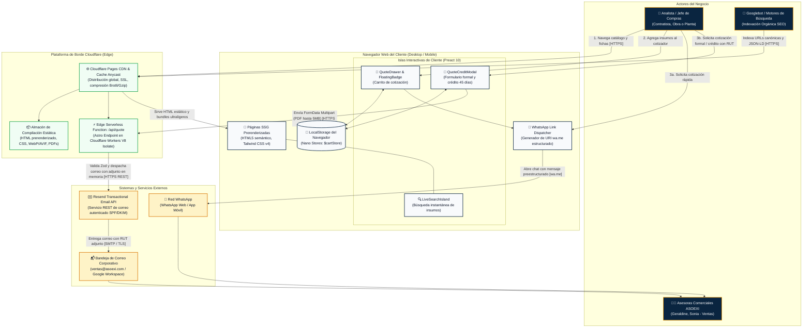

# Diagrama de Contenedores C4 — ASOEXI S.A.S.

## 1. Visión General del Sistema

Este documento define la arquitectura de contenedores (C4 Nivel 2) para la plataforma web corporativa, catálogo B2B y motor de conversión de **ASOEXI S.A.S.** 

El sistema está diseñado bajo el principio de **máxima ligereza, alta velocidad de respuesta y cero dependencias de base de datos activa**, garantizando una calificación superior en Google Core Web Vitals para posicionar el catálogo multimarca en Bogotá y la Sabana de Cundinamarca, a la vez que canaliza solicitudes de cotización de alto volumen hacia WhatsApp y correo corporativo.

---

## 2. Diagrama de Contenedores (C4 Container Diagram)

---

## 3. Matriz de Responsabilidad por Contenedor

| Contenedor | Entorno / Tecnología | Responsabilidades Principales | Almacenamiento / Datos | Protocolos / Interfaces |
| :--- | :--- | :--- | :--- | :--- |
| **Páginas SSG Prerenderizadas** | Astro 7 + Tailwind CSS v4 | - Renderizado inicial de vistas públicas (Home, Catálogo, Fichas de Producto, Silos de Marca, Nosotros, Contacto). - Inyección de metadatos SEO y JSON-LD (`Organization`, `LocalBusiness`, `Product`). - Cero consumo de JavaScript para lectura de contenido. | Ninguno (archivos estáticos compilados). | HTTPS hacia Cloudflare CDN. |
| **Islas Interactivas (Preact)** | Preact 10 (`@astrojs/preact`) | - Buscador de productos con filtrado dinámico en memoria. - Cajón deslizable de cotización (*Quote Drawer*) con selector de cantidades y notas. - Modal de captura de cotización formal y solicitud de crédito a 45 días. | Estado volátil en memoria del componente. | Reactividad cliente con Nano Stores. |
| **Almacén de Estado Local** | `@nanostores/persistent` | - Preservar la lista de insumos agregados por el usuario entre navegaciones y recargas de página. - Sincronización automática y bidireccional con `localStorage`. | `localStorage` del navegador (clave: `asoexi_rfq_cart`). | API Storage del navegador. |
| **Cloudflare Pages CDN** | Red Anycast Cloudflare | - Servir activos estáticos cacheados geográficamente en los centros de datos más cercanos al usuario (Bogotá/Medellín). - Terminación SSL/TLS, compresión Brotli y protección DDoS/WAF. | Caché distribuido en el Edge. | HTTPS / HTTP/3. |
| **Edge Serverless Function (`/api/quote`)** | Cloudflare Workers Runtime (V8 Isolate) | - Endpoint API para recepción de solicitudes formales. - Validación estricta de campos y archivos mediante esquemas **Zod**. - Restricción de archivos: máximo 5 MB, formatos permitidos: PDF, JPG, PNG. - Conversión del archivo a `ArrayBuffer` en memoria y envío directo a Resend. | Memoria efímera del isolate (cero persistencia en disco). | HTTPS POST (Multipart Form-Data) hacia adentro; HTTPS REST hacia Resend. |
| **Resend Email API** | Plataforma SaaS Transaccional | - Envío autenticado de correos transaccionales a nombre de `cotizaciones@asoexi.com`. - Firma DKIM y registros SPF validados en Cloudflare DNS. - Inclusión de archivos adjuntos (RUT / Cámara de Comercio). | Colas de despacho de correo. | HTTPS REST API. |

---

## 4. Flujos de Interacción Clave

### Flujo 1: Descubrimiento SEO e Indexación Orgánica
1. **Googlebot** solicita una página de silo de marca (ej. `/marcas/panduit`).
2. **Cloudflare CDN** entrega el archivo HTML estático generado en la compilación en menos de 100 ms (TTFB óptimo).
3. El documento incluye marcado enriquecido **Schema.org** con datos de distribución autorizada, ubicación geográfica en Bogotá y catálogo de referencias.

### Flujo 2: Consulta y Cotización Inmediata por WhatsApp (Canal Prioritario)
1. El comprador navega el catálogo, selecciona productos y hace clic en *"Agregar a cotización"*.
2. **Preact Island (`CartIsland`)** añade el ítem al store de Nano Stores, persistiendo la selección en `localStorage`.
3. El comprador abre el cotizador, digita sus datos (Nombre / Empresa, NIT, Dirección de obra/planta en Bogotá o Sabana, Tipo de entrega regular o urgencia en 6h).
4. Al pulsar *"Cotizar por WhatsApp"*, el despachador genera una URL `https://wa.me/+57...` con el texto codificado y la plantilla estructurada de 6 campos.
5. Se abre WhatsApp directamente en el dispositivo del cliente con el mensaje redactado para Geraldine o Sonia, eliminando cualquier reproceso o llamada de aclaración.

### Flujo 3: Cotización Formal y Crédito a 45 Días con Adjunto (RUT)
1. El cliente corporativo selecciona la opción *"Solicitud de Cotización Formal / Crédito 45 días"* en el cotizador.
2. Adjunta el documento RUT o Certificado de Cámara de Comercio (PDF hasta 5 MB).
3. La isla de Preact envía la petición vía `POST` multipart a `/api/quote`.
4. La **Edge Function de Cloudflare** valida el tamaño y tipo MIME con Zod, formatea el cuerpo HTML del correo corporativo y llama a la API de **Resend**.
5. Las asesoras de ASOEXI reciben la solicitud completa en `ventas@asoexi.com` con el PDF adjunto listo para radicar la orden o verificar crédito en el sistema contable.

---

## 5. Invariantes de Seguridad y Escalabilidad Operativa

1. **Superficie de Ataque Nula en Datos:** Al no existir base de datos relacional expuesta a internet, se eliminan vectores de inyección SQL, robos de contraseñas y caídas de servidor por saturación de conexiones.
2. **Aislamiento en Memoria (Zero-Disk Persistence):** Ningún archivo adjunto subido por un usuario se almacena en el servidor. El isolate V8 de Cloudflare toma el buffer en memoria, lo transfiere por HTTPS cifrado a Resend y lo libera de inmediato.
3. **Protección de Secretos:** Las claves de API (`RESEND_API_KEY`) nunca forman parte del código fuente ni de los paquetes de cliente; se inyectan como variables de entorno de Cloudflare Pages a nivel de servidor.
